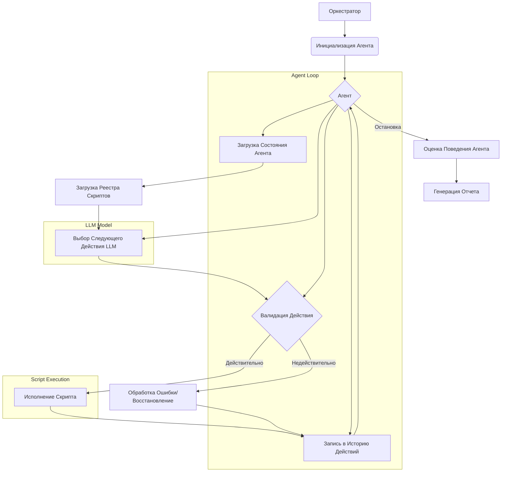

# Отчет об Архитектуре Проекта

## 1. Введение

Данный отчет представляет собой анализ текущей архитектуры проекта "Имитация пользовательской активности группой локальных LLM-агентов" на соответствие Техническому Заданию (ТЗ), изложенному в файле `tz.txt`. Анализ проводился с учетом фактически реализованных этапов, описанных в `tasks.txt` до стадии "experiments". Целью работы является выявление расхождений, избыточных компонентов и архитектурных ошибок, а также формирование рекомендаций для дальнейшего развития.

## 2. Соответствие ТЗ

Проектная архитектура демонстрирует высокое соответствие требованиям `tz.txt` на реализованных этапах.

**Цель работы (из tz.txt):** Разработать и проверить прототип, в котором группа программных агентов имитирует нормальную пользовательскую активность в виртуальной компьютерной сети.
**Соответствие:** Текущая архитектура и выполненные задачи закладывают прочную основу для достижения этой цели, реализуя модули для агентов, оркестратора, LLM-взаимодействия и выполнения скриптов.

**Основные задачи из `tz.txt` и их покрытие:**

*   **1. Анализ возможных средств реализации:** Полностью покрыто этапом `localRuntime` в `tasks.txt`, который включает выбор runtime, smoke-тесты локальных моделей, разработку адаптера для LLM и измерения ресурсов.
*   **2. Проектирование общей схемы работы:** Полностью покрыто этапом `architecture` в `tasks.txt`, где были определены схемы состояния агента, контракты действий, границы ответственности оркестратора и агентов, политики восстановления после сбоев и форматы ролей.
*   **3. Подготовка минимального набора параметризуемых скриптов активности:** Полностью покрыто этапом `scripts` в `tasks.txt`, включающим создание реестра скриптов и реализацию скриптов для работы с файлами, браузером, офисными документами и командной строкой.
*   **4. Реализация прототипа агента:** Полностью покрыто этапом `prototype` в `tasks.txt`, где были созданы каркас агента, механизм выбора действий, система логирования истории и ошибок, мост для выполнения скриптов, тесты восстановления и многоагентного взаимодействия.
*   **5. Проведение экспериментов с разными локальными моделями:** Компоненты для подготовки к этому этапу реализованы в стадии `behaviorEval` (`Normal activity profile schema v1`, `Normal activity trajectory evaluator v1`, `Evaluation scenario pack v1`), однако сами эксперименты еще не проведены.
*   **6. Оценка минимально достаточных ресурсов:** Подготовка к оценке ресурсов (измерения в `localRuntime`) выполнена, но финальная оценка и формулы (как описано в `tz.txt`) будут сформированы на этапе `experiments`.
*   **7. Подготовка краткого отчета по результатам:** Этот этап является завершающим, его структура (`Report skeleton`, `Implementation section draft`) определена в `tasks.txt` для стадии `report`, но сам отчет еще не сформирован.

## 3. Анализ текущей архитектуры

Архитектура проекта является модульной и хорошо структурированной, что способствует гибкости и масштабируемости.

**Ключевые компоненты:**

*   **Оркестратор (Orchestrator):** Отвечает за инициализацию агентов, предоставление начального контекста, ролей и наборов скриптов. Реализован через `src/agent/orchestrator.py` и `src/agent/multi_agent_orchestrator.py`.
*   **Агент (Agent):** Основная единица, которая автономно выбирает и выполняет действия. Представлен `src/agent/agent.py` и использует конфигурации состояния (`configs/agent_state.example.json`).
*   **Интеграция с LLM (LLM Integration):** Компонент для взаимодействия с локальными LLM-моделями через стандартизированный интерфейс (`src/agent/llm_client.py`), с поддержкой различных рантаймов и моделей.
*   **Механизм выбора действий (Action Selector):** Определяет логику выбора следующего действия агентом на основе роли, состояния, доступных скриптов и истории. Реализован в `src/agent/action_selector.py` и использует контракт действий (`src/agent/action_contract.py`).
*   **Реестр и Исполнитель Скриптов (Script Registry & Runner):** Хранит описания параметризуемых скриптов (`configs/script_registry.example.json`) и обеспечивает их безопасное выполнение (`scripts/script_execution_bridge.py`). Включает валидацию действий и нормализацию ошибок.
*   **История и Восстановление (History & Recovery):** Отслеживает выполненные действия и ошибки (`src/agent/execution_history.py`), а также предоставляет механизмы для восстановления после сбоев (`src/agent/recovery.py`).
*   **Управление Ролями и Контекстом (Role & Context Management):** Определяет роли пользователей, ограничения и предпочтения (`src/agent/activity_profile.py`, `configs/role_template.example.json`).
*   **Фреймворк Оценки Поведения (Behavioral Evaluation Framework):** Набор инструментов для оценки соответствия поведения агентов заданным профилям активности (`src/agent/activity_evaluator.py`, `src/agent/model_behavior_evaluation.py`).

**Диаграмма Потока Данных:**

**Сильные стороны архитектуры:**

*   **Модульность:** Четкое разделение компонентов (оркестратор, агент, LLM-клиент, скрипты, валидаторы) упрощает разработку, тестирование и поддержку.
*   **Конфигурируемость:** Использование JSON/YAML файлов для конфигурации ролей, скриптов и состояний позволяет легко адаптировать систему без изменения кода.
*   **Гибкость LLM:** Абстракция взаимодействия с LLM через `llm_client.py` позволяет использовать различные локальные модели.
*   **Управляемые Скрипты:** Параметризуемые скрипты с валидацией обеспечивают контролируемую и безопасную имитацию активности.
*   **Наличие Механизмов Восстановления:** Заложенные принципы обработки ошибок и восстановления повышают надежность системы.
*   **Фреймворк Оценки:** Наличие выделенного фреймворка для оценки поведения агентов является критически важным для экспериментальной проверки подхода, как того требует ТЗ.

## 4. Выявленные расхождения и области для улучшения

**Расхождения с `tz.txt`:**

Основное "расхождение" заключается в том, что задачи 5, 6 и 7 из `tz.txt` (проведение экспериментов, оценка ресурсов и формирование итогового отчета) находятся на стадиях подготовки или еще не начаты. Тем не менее, все необходимые архитектурные и программные компоненты для выполнения этих задач уже разработаны или находятся в высокой степени готовности (согласно `behaviorEval` и `report` в `tasks.txt`). Это не является архитектурной проблемой, а скорее указывает на текущий статус выполнения проекта.

**Избыточные компоненты:**

На данном этапе анализа явных избыточных компонентов не выявлено. Все присутствующие модули и конфигурации, судя по их названиям и описаниям задач, напрямую способствуют достижению целей, описанных в `tz.txt`.

**Архитектурные ошибки:**

Архитектурных ошибок на высоком уровне не обнаружено. Дизайн выглядит продуманным и соответствует поставленным целям.

## 5. План дальнейших действий

**Что реализовано:**

*   Выбор и интеграция локальных LLM-рантаймов и моделей.
*   Проектирование и реализация базовой схемы взаимодействия оркестратора и агентов.
*   Определение структуры состояния агента, контрактов для выбора действий и форматов ролей.
*   Разработка реестра параметризуемых скриптов активности (файлы, браузер, офисные документы, команды).
*   Реализация прототипа агента, включая выбор действий, выполнение скриптов, логирование истории и ошибок, а также механизмы восстановления.
*   Разработка фреймворка для оценки поведения агентов и сценариев экспериментов.

**Соответствует ли архитектура ТЗ:**

Архитектура проекта полностью соответствует Техническому Заданию (`tz.txt`) в части проектирования и реализации прототипа агента и необходимых для него подсистем. Обеспечены все необходимые механизмы для дальнейшего проведения экспериментов и оценки.

**Что требует изменения/дальнейшей работы:**

*   **Проведение экспериментов (tz.txt, задача 5):** Запустить разработанные сценарии оценки с различными локальными моделями для сбора данных о качестве выбора действий, соответствии ролям и разнообразии активности.
*   **Оценка ресурсов (tz.txt, задача 6):** На основе результатов экспериментов и метрик `localRuntime`, провести детальную оценку необходимых вычислительных ресурсов (RAM, CPU, задержка) и определить формулу для одновременного запуска нескольких агентов.
*   **Формирование итогового отчета (tz.txt, задача 7):** Составить полный отчет, включающий результаты экспериментов, сравнение моделей, оценку ресурсов, выявленные ограничения и рекомендации по дальнейшему развитию.
*   **Уточнение политики восстановления:** Возможно, потребуется дальнейшее усовершенствование политики восстановления (`Failure recovery policy`) на основе реальных данных из экспериментов.
*   **Расширение набора скриптов (опционально):** При необходимости расширить библиотеку скриптов активности, добавив, например, работу с почтой или системами контроля версий, как упоминается в `tz.txt`.
